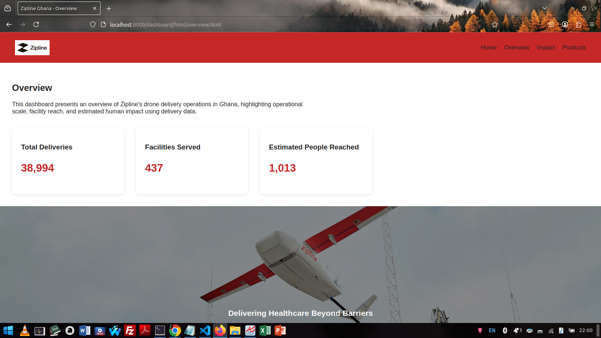
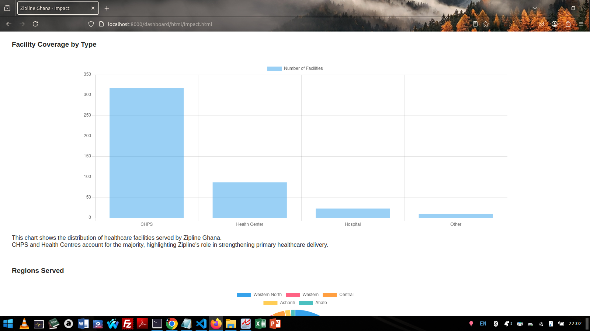
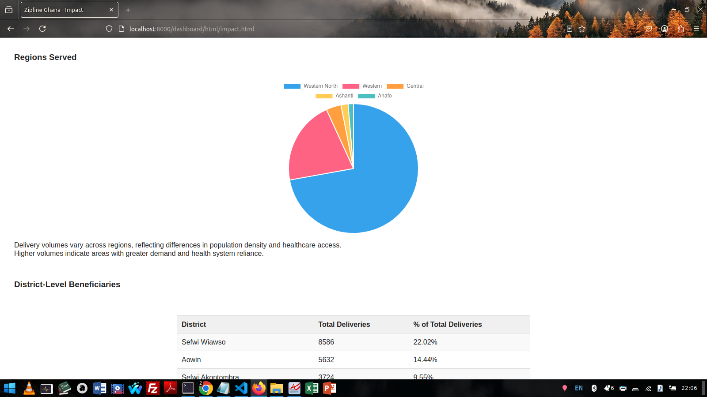
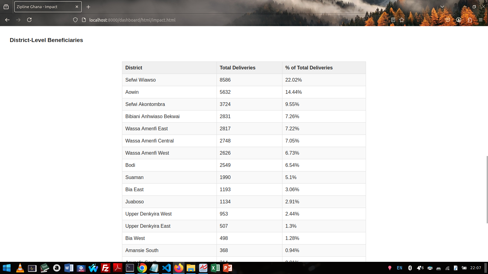
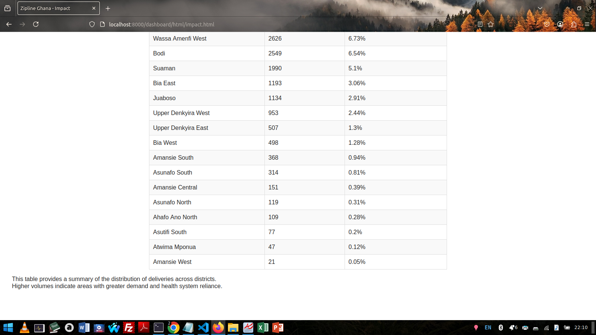
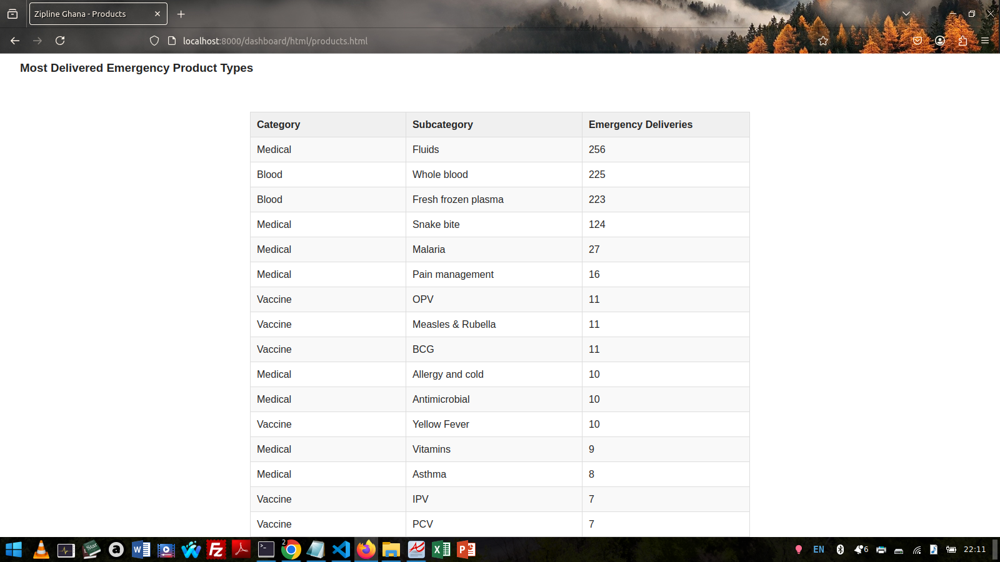
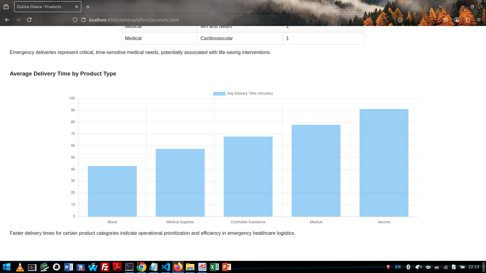

# DELIVERING IMPACT; A DATA-DRIVEN STORY OF ZIPLINE'S VALUE IN GHANA

## PROJECT SUMMARY

**Project Overview**
This project is a data-driven dashboard designed to highlight the operational value, geographic reach
and human impact of Zipline's operations in Ghana.
    
Using synthetic delivery and health facility datasets, the project demonstrates how Zipline’s deliveries 
support health facilities, distribute essential medical products, and respond to life-critical emergencies. 
The final output is a **localhost dashboard website** supported by a robust SQL data-cleaning and analysis pipeline.

**Project Structure**
```
zipline-capstone/
│
├── dashboard/                      # Frontend dashboard files
│   ├── html/
│   │   ├── index.html              # Home / landing page
│   │   ├── overview.html           # Operational overview
│   │   ├── impact.html             # Impact & geographic coverage analysis
│   │   └── products.html           # Product delivery analysis
│   │
│   ├── css/
│   │   └── style.css               # Global dashboard styles
│   │
│   ├── js/
│   │   ├── overview.js             # Overview page charts
│   │   ├── impact.js               # Impact page charts & tables
│   │   └── products.js             # Products page visualizations
│
├── data/
│   ├── original/                   # Raw datasets 
│   │   ├── Deliveries.csv
│   │   └── Facilities.csv
│   │
│   └── processed/                  # Cleaned & derived JSON files
│       ├── overview_kpis.json
│       ├── facilities_by_type.json
│       ├── deliveries_by_region.json
│       ├── deliveries_by_district.json
│       ├── products_by_category.json
│       ├── emergency_products.json
│       └── avg_delivery_time_by_product.json
│
├── sql-scripts/
│   └── sql/
│       ├── 01_create_tables.sql
│       ├── 02_import_datasets.sql
│       ├── 03_cleaning_tables.sql
│       ├── 04_create_views.sql
│       ├── 05_operationalvalue_analysis.sql
│       ├── 06_geo_facilitycoverage_analysis.sql
│       ├── 07_humanimpact_analysis.sql
|       |── 08_sqljson_conversion.sql
│
├── documentation/
│   ├── screenshots/                # Dashboard screenshots
│   └── README.md                   # Project documentation
│
└── .gitignore
```
    
**Project Objectives**
The project answers three key questions:

**A. Operational Value**
- How many deliveries were made over time?
- What types of products were delivered (e.g., vaccines, blood, essential medicines)?
- Which regions or districts received the most support?

**B. Facility & Geographic Coverage**
- How many health facilities have benefited from these deliveries?
- What types of facilities were supported (clinics, CHPS, hospitals)?
- What level of support was provided to each of the various facility groups (Health Centres,CHPS, Hospitals etc)

**C. Human Impact**
- Assuming that each emergency delivery was for a patient in critical conditions, how many
  lives may have been saved within the period?
- Which communities or districts appear most dependent on Zipline's services?


## TOOLS USED
1. Database: MySQL - Data storage, cleaning, aggregation, and JSON generation
2. Query Language: SQL
3. Data Analysis: SQL aggregations and views
4. Frontend: 
   - HTML -  Page structure
   - CSS - Layout, styling, responsiveness
   - JavaScript -  Data fetching and DOM manipulation
5. Visualization: Chart.js
6.  Data fetching and DOM manipulation
7. Version Control: Git & GitHub


**Data Sources**
Two synthetic datasets were used:

1. Delivery Records
Each row represents a single delivery made to a health facility.

Key fields include:
- Delivery priority (Emergency, Resupply, Scheduled)
- Product category and subcategory
- Order and delivery timestamps
- Number of units delivered
- Facility name and locality

2. Health Facility Data
Each row represents a unique health facility.

Key fields include:
- Facility type (Hospital, Clinic, CHPS, Health Centre)
- District and region
- Delivery site identifier

### DATA CLEANING AND PREPARATION
1. Removed trailing spaces from particular columns

2. Checked and normalize case inconsistencies in text-type data types

3. Checked for null values/ blank spaces and fixed where necessary in all columns.
**SITE_ID NULLS**
Background Rationale:
A total of 59 facilities had missing/null SITE_ID values.
Cross-referencing with the 'deliveries' table confirmed 58 of these were never served, 
justifying their missing 'SITE_ID' values.
'Asawinso SDA HSP' was the single exception: it received packages but was missing its 'SITE_ID'.
The new, valid 'SITE_ID' was sourced directly from the GH2 Zipline Controller Team on 9th Dec, 2025.

```-- check to confirm NULL state ---
SELECT FACILITY_NAME, DISTRICT,
       REGION, SITE_ID
       FROM  facilities
       WHERE FACILITY_NAME = 'Asawisno SDA HSP' AND SITE ID IS NULL; --since all blanks were set to NULL initially

-- update 'SITE_ID' as found from Controller Team --
UPDATE facilities
     SET SITE_ID = 1309 --valid site_id from Controller Team
     WHERE FACILITY_NAME = 'Asawinso SDA HSP' AND SITE_ID IS NULL;
```
**TIME_ORDER_CONFIRMED_LOCAL NULLS**

Discovered later that some TIME_ORDER_CONFIRMED_LOCAL values were stored
as the zero datetime '0000-00-00 00:00:00' instead of NULL.
This explains why the earlier check

```
SELECT * FROM deliveries WHERE TIME_ORDER_CONFIRMED_LOCAL IS NULL;
```
returned an empty set even though the column looked blank in the source data.
 Since the dataset is expected to start from 2023‑01‑01, any timestamp
earlier than 2022‑12‑31 is treated as invalid / missing and should be NULL.
The following statements implement that assumption and clean the data:

```--	Inspect potentially invalid timestamps (including zero dates) ---
SELECT DELIVERY_KEY, HEALTH_FACILITY_NAME, 
	TIME_ORDER_CONFIRMED_LOCAL , TIME_DELIVERED_LOCAL
	FROM deliveries WHERE TIME_ORDER_CONFIRMED_LOCAL < '2023-01-01';

--Convert all such invalid timestamps to NULL so that future checks using
--    TIME_ORDER_CONFIRMED_LOCAL IS NULL correctly identify missing values.
UPDATE deliveries
	SET TIME_ORDER_CONFIRMED_LOCAL = NULL
	WHERE TIME_ORDER_CONFIRMED_LOCAL < '2022-12-31';
```
4. Check for duplicates
for 'delivery_key' column in deliveries table
The duplicates identified were found to be valid, as the same delivery key may refer to 
multiple product deliveries (e.g.one row with Paracetamol, another with Diclofenac Gel).
These deliveries were part of the same shipment, and no further data cleaning is needed.
Total number of delivery keys with duplicates: 6188.

```SELECT delivery_key, COUNT (*) AS count 
FROM deliveries
GROUP BY delivery_key
HAVING COUNT(*) >1;

-- for facility_id in facilities table
-- returns no duplicate values in this column
SELECT facility_id, COUNT (*) AS count 
FROM facilities
GROUP BY facility_id
HAVING COUNT(*) >1;
```

5. Check for invalid or negative values
**Timestamp Validation**
131 delivery records (0.33% of total) were found where delivery timestamps occurred before order timestamps. 
These records were treated as data-entry inconsistencies and excluded from analysis.

A cleaned delivery view was created

```CREATE VIEW deliveries_valid AS 
	SELECT *, TIMESTAMPDIFF(MINUTE, TIME_ORDER_CONFIRMED_LOCAL, TIME_DELIVERED_LOCAL)
	 AS DELIVERY_DURATION_MINUTES FROM deliveries WHERE TIME_DELIVERED_LOCAL >=  TIME_ORDER_CONFIRMED_LOCAL;
```

**Data Integration**
To simplify analysis, the cleaned delivery data was joined with facility metadata to create a unified analysis-ready view:
All analysis and dashboard metrics are derived from this unified dataset.

```CREATE VIEW deliveries_complete AS
SELECT
	d.*,
	f.FACILITY_ID,
	f.FACILITY_NAME,
	f. FACILITY_TYPE,
	f.DISTRICT,
	f.REGION,
	f. SITE_ID
FROM deliveries_valid d
INNER JOIN facilities f
ON d.HEALTH_FACILITY_NAME = f.FACILITY_NAME;
```

**Data Pipeline**
```
-----------------------              -----------------------------
| deliveries (raw)     | ------------> | facilities (raw)        |
-----------------------              -----------------------------
               |                           |
               v                           v
        -------------------         -----------------------
        | Clean (deliveries) |       | Clean (facilities)  |
        -------------------         -----------------------
               |                           |
               v                           v
        -------------------         ---------------------------
        | deliveries_valid  | ----> | deliveries_complete     |
        -------------------         ---------------------------
                                            |
                                            v
                                    ---------------------
                                    | Final for Analysis |
                                    ---------------------
```
#### METRICS AND ANALYSIS
The following metrics were computed to address the project objectives:

**Operational Value**
- Total deliveries over time (monthly)
- Total number of valid deliveries
- Product categories(types) delivered
- Regions and Districts receiving the most support
- Average delivery time by product type
- Average delivery time by priority

**Facility & Geographic Coverage**
- Total number of facilities served
- Types of facilities served
- Level of support per facility group, which covered the ff;
    - Deliveries by facility type
    - Priority Distribution by Facility Type
    - Performance(units delivered and product variety)  per Facility Type
    - Minimum and Maximum deliveries per facility within each type
    
**Human Impact**
- Estimated lives saved (count of emergency deliveries)
- Emergency deliveries by district
- Most-delivered emergency product types
- Average emergency response time

**ASSUMPTIONS MADE**
1. Each emergency delivery potentially corresponds to one patient in critical condition, representing a 
   conservative estimate of lives saved.

2. Any facility missing a SITE_ID (59) was checked against delivery records and found not to have received deliveries in 
   2023, except for Asawinso SDA HSP, which had a missing SITE_ID. This was updated after getting the correct information 
   from the GH2 Zipline Controller Team.
   
3. The data is for deliveries from January 1, 2023, onward. Any timestamps before this date or stored as 
   "0000-00-00" were treated as invalid and set to NULL.
   
4. A single DELIVERY_KEY may represent multiple products delivered together in one flight

5. Delivery times show the actual time from order confirmation to delivery completion. Without ETA data, we can't 
   compare actual delivery times to targets, so the focus is on general statistics and patterns instead of performance goals.
   
6. 'Health Facility Locality' in the deliveries table and 'District' in the facilities table are the same 
    thing and are used interchangeably in this analysis.
    
7. Analysis is based on the 'deliveries_complete view'', which includes only records with valid timestamps 
   and combines delivery and facility data.
   
8. Deliveries where delivery time preceded order time (131 records, 0.33% of data) were excluded from analysis as logically invalid.

9. Dataset did not show 'Facility rural/urban' classification hence was excluded.

#### SQL to JSON Conversion for Dashboard

To support the static frontend dashboard, the results of key SQL analysis queries were exported directly from MySQL into JSON format.
This was achieved using MySQL’s JSON_OBJECT and JSON_ARRAYAGG functions together with INTO OUTFILE, allowing aggregated metrics 
(KPIs, regional summaries, facility coverage, and product breakdowns) to be saved as structured .json files.

These JSON files serve as the data source for the dashboard’s visualizations and are loaded in the browser using
JavaScript and rendered with Chart.js.

##### LOCALHOST DASHBOARD WEBSITE

This project includes a static, data-driven dashboard website built with HTML, CSS, and JavaScript, designed to visualize
and communicate insights derived from Zipline’s delivery operations data in Ghana. 
The dashboard runs locally and uses preprocessed JSON files generated from SQL queries as its data source.

The dashboard consists of three main pages, each serving a distinct analytical purpose.

**1. Overview Page**
The Overview page provides a high-level snapshot of Zipline’s operational scale and impact.

Key Features:
- Total Deliveries
Displays the total number of completed deliveries across the dataset.

- Total Facilities Served
Shows the number of distinct healthcare facilities reached.

- Estimated People Reached
Approximates human impact using emergency-priority deliveries as a proxy.

- Narrative Introduction
A short contextual paragraph explaining:
The scope of the data (single operational center, one-year period)
The synthetic nature of the dataset
The purpose of the dashboard (operational value and impact storytelling)
These metrics are presented using KPI cards, allowing users to immediately grasp the scale and relevance of Zipline’s operations.

**2. Impact Page**
The Impact page focuses on geographic and facility reach.

Visualizations and Tables:
- Facility Coverage by Type (Bar Chart)
Shows the number of distinct facilities served, grouped by facility type (e.g., hospitals, clinics).

- Deliveries by Region (Pie Chart)
Visualizes how deliveries are distributed across regions, emphasizing geographic coverage.

- District-Level Beneficiaries (Table)
A detailed table showing:
- Total deliveries per district
- Percentage contribution to overall deliveries
- The table includes clear borders, alternating row colors, and readable spacing to improve clarity.

**Note on Rural vs Urban Impact:**
The source dataset does not explicitly label facilities as rural or urban. 
As a result, this distinction could not be reliably derived and is acknowledged as a limitation of the analysis.

**3. Products Page**
The Products page explains what Zipline delivers and why those deliveries matter.

- Product Types Delivered (Bar Chart)
Displays delivery volume by product category (e.g., Vaccines, Medical, Blood, Controlled Substances), 
--including percentage contribution to total deliveries.

- Most Delivered Emergency Products (Table)
Breaks down emergency deliveries by product category and subcategory, highlighting 
which medical products are most critical during urgent situations.

- Average Delivery Time by Product Type (Bar Chart)
Shows average delivery duration for each product category, offering insight into operational performance and prioritization.

**How to Run the Dashboard Locally**

**Prerequisites**
- Python 3 installed
- A modern web browser (Chrome, Firefox, Edge)

**Steps**
1. Navigate to the dashboard directory:
```
cd dashboard
```
   
2. Start a local web server:
```
python3 -m http.server
```
- On Windows, if python 3 does not work
```
python -m http.server
```

3. Open a browser and visit
```
http://localhost:8000/dashboard/html/index.html
```
*The dashboard will load and display all charts using locally stored JSON data.*

##### SCREENSHOTS

**Overview Page**


**Impact Page**








**Products Page**








##### Design Decisions & Visualization Refinements
**Purpose of This Section**
This section documents key analytical and visualization decisions made during dashboard development to improve clarity, 
interpretability, and storytelling impact. These refinements ensure that insights are communicated effectively to both 
technical and non-technical audiences.

**A. Chart Selection & Layout Decisions**
- Pie charts were used where the objective was to show proportional contribution (e.g., facility coverage and regional delivery share).
- Bar and horizontal bar charts were used where comparisons across categories or locations were more important than proportionality.
- Horizontal bar charts were preferred for datasets with many categories or long labels, improving readability and reducing label crowding.

**B. Percentage-Based Interpretation**
- Percentages were computed and displayed alongside raw values to support relative interpretation, especially where total volumes varied significantly.
- For pie charts, percentage labels were placed directly on slices to reduce reliance on legends and tooltips.
- For bar charts, percentage labels were positioned at the end of bars to support quick comparison without visual tracing.

**C. Handling Small Values & Visual Crowding**
- For pie charts with very small segments, data labels were conditionally positioned outside the slice to prevent overlap.
- Layout padding and legend repositioning were applied to ensure that external labels did not obscure legends or chart content.
- Conditional styling (background boxes, borders, font color changes) was used to maintain readability for small-percentage labels.

**D. Minimum Bar Length Trade-off**
- A minimum bar length was applied to some bar charts to ensure that very small values remained visible.
- This approach was intentionally not used universally, as it can distort perceived magnitude differences.
- For emergency product analysis, a horizontal bar layout and percentage labels were prioritized instead of enforcing minimum bar length.

**E. Tooltip vs On-Chart Labels**
- Tooltips were retained to show raw values and precise percentages for detailed inspection.
- On-chart labels were added to support immediate insight without interaction, improving accessibility and presentation clarity.
- This dual-layer approach balances analytical depth with executive-level readability.

**F. Data Processing & JSON Integration**
- Processed datasets were exported as structured JSON files to decouple data processing from visualization logic.
- This approach improves maintainability, supports future updates, and allows charts to be regenerated without modifying SQL logic.
- Manual JSON creation was used where system constraints (e.g., file export permissions) made direct database export impractical.

**Dorsphil Osei Asuming Animwaa**

**Data Analyst Intern**

**Zipline Ghana**


